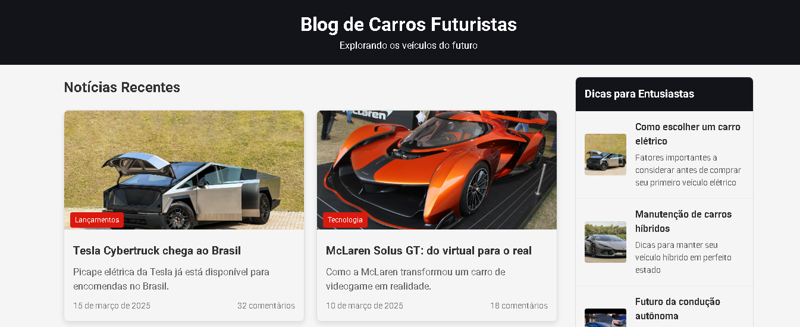

## 
 - 📋 Projeto  Blog Carros-Futurista !!!

 

  

**✔Clique e Conheça ** - Carros Futurista. Acesse agora: <a href="https://react-js-projeto-blog-carros-futuristas-8tpfcpabp.vercel.app" style="font-size:120%;" target="_blank">Blog !!</a>

O Blog de Carros Futuristas é uma plataforma moderna dedicada à exibição e discussão dos veículos mais inovadores do mundo automotivo. Apresentando designs revolucionários, tecnologias de ponta e conceitos que definem o futuro da mobilidade, este blog serve como um showcase interativo para entusiastas e profissionais do setor.
Visualize os carros mais extraordinários do futuro em um layout intuitivo e responsivo!

🏎️ Carros do Futuro    🏎️ 🚗 🚙 🏍️ 🚓 🚕 🚘 🚖 🚔 🚛 🚚 🚒

---
## 🚀 Funcionalidade

📰 Notícias Recentes: Atualizações sobre os últimos lançamentos e inovações
📊 Ranking de Vendas: Visualização dos modelos futuristas mais vendidos
🖼️ Galeria de Carros: Exibição detalhada de carros conceito e protótipos
🔍 Detalhes Interativos: Janelas modais com informações específicas de cada veículo
📱 Layout Responsivo: Experiência otimizada em dispositivos desktop e móveis

---
## @@🛠️ Tecnologias Utilizadas
TecnologiaUso no Projeto

⚛️ React.jsBiblioteca para construção de interfaces de usuário

📦 Node.jsAmbiente de execução JavaScript

🎨 CSS3Estilização avançada com CSS puroGit/GitHubControle de versão e hospedagem do código

🧩 npmGerenciador de pacotes

📜 JavaScript ES6+Linguagem de programação principal

GitHub PagesHospedagem do site estático

---
## 🚧 Desafios Enfrentados

Durante o desenvolvimento do projeto, enfrentamos diversos desafios técnicos que contribuíram para nosso aprendizado: inclusive com o angular  por isso nao foi usado.

Compatibilidade de Versões:

Problemas com diferentes versões do React (18.2.0 vs 18.3.1)
Conflitos entre dependências que causaram erros de exportação

Modal Interativo:

Implementação de janelas modais personalizadas para cada carro
Carregamento dinâmico de conteúdo baseado no carro selecionado

Layout Responsivo:

Adaptação do design para diferentes tamanhos de tela
Manutenção da estética futurista em todos os dispositivos

Gerenciamento de Estado:

Controle eficiente do estado da aplicação sem bibliotecas adicionais
Atualização de componentes baseada na interação do usuário

Problemas de Deployment:

Configuração para deploy no GitHub Pages
Resolução de problemas com rotas e caminhos base

📱 Layout e Responsividade
O projeto foi desenvolvido com foco em uma experiência de usuário fluida tanto em desktops quanto em dispositivos móveis (projeto ainda nao concluido )

---
 Implementar sistema de busca/filtros
 Adicionar páginas individuais para cada carro
 Implementar sistema de comentários
 Melhorar a acessibilidade
 Adicionar testes automatizados

👥 
Agradeço sinceramente a oportunidade de compartilhar este projeto, que, embora simples, representa um marco significativo no meu aprendizado em desenvolvimento web. Reconheço que ainda tenho um longo caminho a percorrer e muito a aprender, mas estou comprometido em continuar me dedicando e aprimorando minhas habilidades. Este projeto foi desenvolvido com a base de referncia da Aula do Pro.felipe na Dio. ( Criando um Blog com Angular ) Decola Tech 2025

Feito por Jose Escudero (um dev em aprendizado!).

"DEV APRENDIZADO" - Porque cada linha de código é um passo adiante!

